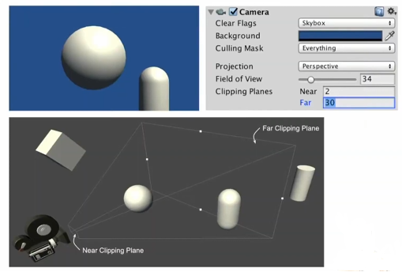

# Camera와 Cullting
> [이 영상](https://youtu.be/O0qliGO7Oes?feature=shared)을 보고 정리한 글입니다.<br>

## MVP Transformation
- 카메라를 비롯한 게임 오브젝트들은 항상 업데이트가 일어난다.
- 정확히는 Vertex에 대한 정보들이 계속 갱신되는 것이다.

### Mesh - Vertex
- 게임 오브젝트의 형태는 Mesh로 구성되어 있다.
- Mesh는 다시 여러 개의 Polygon으로 이루어져 있다.
- Polygon은 3개의 Edge로 이루어져 있다.
- Edge는 3개의 Vertex로 이루어져 있다.


- 즉, 게임 오브젝트의 움직임은 게임 오브젝트를 구성하는 vertex의 움직임이다.

### Model / Local / Object space

- 게임 오브젝트 자체의 공간
- 아직 씬(scene)에 올리지 않았을 때, 게임 오브젝트를 구성하는 vertex들의 좌표를 위한 공간이다.

### World space

- 씬(scene)을 기준으로 하는 공간
- Unity editor에서 씬을 보고 있을 때, 각 게임 오브젝트들의 좌표를 위한 공간이다.

### View / Camera space

- 카메라를 기준으로 하는 공간
- 카메라의 위치가 (0, 0, 0)이 되어서 각 오브젝트들에 대한 좌표가 설정된다.

### Clip space

- 카메라가 투영하고 있는 공간
- 아무리 3D공간이라 하더라도 카메라에 투영되는 화면은 2D이다.
- 투영되는 공간 - 2D에서의 각 오브젝트들의 좌표가 설정된다.

### Transform
- 게임에 있는 vertex들의 좌표는 매 프레임마다 변환된다.
	1. World trasnform
		- Model space에서 World space로 변환
	2. View transform
		- World space에서 View space로 변환
	3. Projection transform
		- View space에서 Clip space로 변환

> View space가 필요한 이유
> - World space에서 Clip space로 바로 변환해도 상관 없다.
> - 하지만, 계산을 좀 더 단순화 하기 위해서 World space에서 View space로 변환한다.

```C#
// Unlit.Shader
Varyings vert(Attributes input)
{
	Varyings output = (Varyings)0;

	UNITY_SETUP_INSTANCE_ID(input);
	UNITY_TRANSFER_INSTANCE_ID(input, output);
	UNITY_INITIALIZE_VERTEX_OUTPUT_STEREO(output);

	VertexPositionInputs vertexInput = GetVertexPositionInputs(input.positionOS.xyz);
	// Object space = OS
	output.vertex = vertexInput.positionCS;
	// Clip space = CS
	output.uv = TRANSFORM_TEX(input.uv, _BaseMap);
	output.fogCoord = ComputeFogFactor(vertexInput.positionCS.z);

	return output;
}
```

```C#
// ShaderLibrary/ShaderVariablesFunctions.hlsl

VertexPositionInputs GetVertexPositionInputs(float3 positionOS)
{
	VertexPositionInputs input;
	input.positionWS = TransformObjectToWorld(positionOS);
	input.positionVS = TransformWorldToView(input.positionWS);
	input.positionCS = TrasnformWorldToHClip(input.positionWS);

	float4 ndc = input.positionCS * 0.5f;
	input.positionNDC.xy = float2(ndc.x, ndc.y * _ProtectionParams.x) + ndc.wl
	input.positionNDC.zw = input.positionCS.zw;

	return input;
}
```

## Frustum Culling
- Unity에서 기본적으로 제공되는 Culling
- 랜더링을 할 때, 카메라에 보이는 것들만 랜더링하는 것을 Culling이라고 한다.
- 카메라가 비추고 있는 공간을 Frustum 공간이라고 한다.
- Frustum Culling은 Frustum 공간에 게임 오브젝트가 있는지 없는지 판단하는 방식의 Culling 기법이다.
- MVP transformation처럼 매 프레임마다 일어난다.



> - 보통 모바일환경에서는 카메라의 Far 값을 낮춘다.
> - 그리고 보이지 않는 부분에 대해서는 Fog end처리를 해준다.
>	- 안개가 낀것처럼 보이지 않는 부분을 자연스럽고 부드럽게 처리한다.

## Occlusion Culling
- 가려진 것들은 렌더링하지 않는 Culling 기법이다.
- 게임 오브젝트에서 무언가를 가리는 오브젝트를 Occluder라고 한다.
	- 보통 정적인 오브젝트가 해당된다.
- Occluder로 인해 가려지는 오브젝트를 Occludee라고 한다.
	- 보통 동적인 오브젝트가 해당된다.


- 벽이 많거나 물체를 가리는 일이 많은 경우에 사용해서 Drow call을 획기적으로 줄일 수 있다.
- 그렇다고 맥락없이 Occlusion culling을 사용하면 되려 성능이 나빠질 수도 있다.

## Spatial Partition


- 매 프레임마다 Culling이 들어가는 것은 오버헤드가 많이 든다.
- 따라서 Spatial partition - 공간 분할 기법으로 최적화를 한다.
- 2D에서는 Octree, 3D에서는 Quadtree를 사용한다.
	- 둘 모두 원리는 동일하다.
	- 공간을 계속해서 4등분을 하는 것
- 물론, 획기적으로 빨라지지는 않는다.
	- 공간을 분할하고 관리해야하기 때문이다.
	- 가령, 어떤 오브젝트가 이동하고 있을 때 어느 partition에 있는지 계속 추적해야 한다.
	- 그러나 비교적 최적화가 된다.

### Magic number ?
- Culling을 최적화하기 위한 parition이 들어갈 때, 공간을 얼만큼 잘라내어야 하는지에 대한 문제가 있다.
- 이에 대한 문제는 Magic number에 기댈 수 밖에 없다.
	- 맥락에 따라 다르기 때문에, 그때마다 값이 달리질 수밖에 없다.