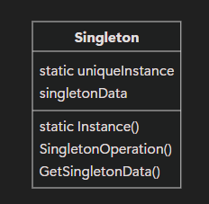

# 싱글톤(Singleton)

## 개념
- 인스턴스를 만들 때, 오직 한 개의 인스턴스만 갖도록 보장하는 디자인 패턴이다.
- 그리고 단 하나의 인스턴스에 대해서 전역적인 접근을 허용하는 디자인 패턴이다.
- 가령, 수많은 파일이 있다 하더라도 파일 시스템은 단 하나여야 한다.
- 싱글톤 패턴에서 중요한 것은 유일한 인스턴스에 접근하도록 관리하는 것이다.
	- 여러 개의 인스턴스가 생성되지 않도록 하는 것
	- 인스턴스에 대한 접근 방법을 제어하는 것



## 왜 싱글톤을 사용하는가?
- 가장 큰 이유는 전역변수이다.
- 전역 변수는 어디에서나 접근이 가능하다.
	- 때문에, 어디에서 전역변수의 값이 수정되는지 추적하기 어렵다.
	- 그리고, name space가 오염된다.
		- name space 내부에 전역 변수를 관리한다고 해도, 변수 이름이 충돌 될 수 있다.

``` c++
// file a.cpp
myspace::string str = "AAA";

// file b.cpp
myspace::string str = "BBB";
```

- 싱글톤은 이러한 전역 변수의 단점들을 보완하고 있다.
	- 접근가능한 방법이 통제된다는 점에서 어느 정도 로깅을 통해 추적이 가능하다.
	- 싱글톤은 전역변수가 아니기 때문에, name space가 오염되지 않는다.

## C++ 예시

```c++
class Singleton
{
public:
	static Singleton* Instance(); // 유일한 접근 방식
protected:
	Singleton(); // 자기 자신과 상속된 개체에서만 사용 가능
private:
	static Singleton* _instance;
}
```

```c++
Singleton* Singleton::_instance = NULL;

Singleton* Singleton::Instance()
{
	if (_instance == NULL)
	{
		_instance = new Singelton;
	}
	return _instance;
}
```

## Unity에서의 싱글톤
- 게임에서는 게임 메니저와 같은 요소가 전체 게임에서 단 하나만 있어야 하는 - 싱글톤에 적절한 요소이다.
- 일반적인 코드와 다르게, Unity 에서는 `Monobehavior`가 상속되어 있어야 하고, 게임 오브젝트에 컴포넌트로 포함되어야 한다.

```C#
class Managers: Monobehavoir
{
	static private Managers _instance;

	static public Managers GetInstance()
	{
		return _instance;
	}
}
```

- 이때, 고려해야 할 것은 `_instance`가 단 하나여야 한다는 것이다.
	- 단순히 생성(Start)될 때, `_instance`에 자기 자신을 대입하는 것은 여러 개의 Managers가 있게 되면, 더이상 싱글톤이 아니게 된다.
	- 단 하나의 게임 오브젝트의 유일한 Managers의 인스턴스로 초기화 해주어야 한다.
	- 하지만, 만일 게임 오브젝트가 없는 경우(`null`) 새로운 게임 오브젝트를 생성해 주고, Managers에 대한 인스턴스를 확보해야 한다.

```C#
static private void Init()
{
	if (_instance == null)
	{
		// @Managers라는 게임 오브젝트를 찾는다.
		GameObject gameObject = GameObject.Find("@Managers");

		if (gameObject == null)
		{
			// 새로운 오브젝트 생성
			gameObject = new GameObject{ name = "@Managers" };
			gameObject.AddComponent<Managers>();
		}
		DontDestroyOnLoad(gameObject); // 삭제되지 않게 설정
		_instance = gameObject.GetComponent<Managers>();
	}
}
```