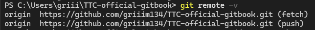
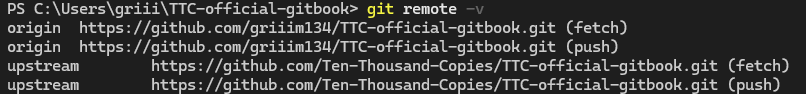

# Origin 과 Upstream 동기화

> - 원본 repo를 upstream. Fork를 한 repo를 origin 이라고 한다.

## 1. 원격 저장소 등록
- 보통 Fork를 한 뒤, origin repo를 clone하고 원격 저장소를 확인하면, upstream이 등록되어 있지 않다.



- upstream을 등록해야 upstream의 내용들을 로컬에 가져올 수 있다.
- 따라서, 다음과 같이 등록한다.

```bash
$ git remote add upstream [upstream repo url]
```

- 이렇게 하면, 등록된 것을 확인 할 수 있다.



## 2. Fetch 하기
- Fetch는 지정한 저장소의 변경사항을 가져와 로컬 repo의 데이터베이스에 저장한다.
	- 실제 변경된 사항들에 대해서는 가져오지 않는다.
- 따라서, Fetch를 통해 upstream 으로 등록한 원격 저장소의 변경사항을 최신화한다.

```bash
$ git fetch upstream
```

## 3. Merge
- Merge 는 지정한 브랜치의 내용과 현재 브랜치의 내용을 합친다.
- 로컬의 origin 브랜치에 upstream의 브랜치를 합치면 된다.

```bash
$ git merge upstream/main
```

## 4. Pull
- 그런데 더 단순한 방법이 있다.
- Fetch와 Merge를 하나로 해주는 것이 Pull 명령어이다.
- 따라서, 단순하게 가져오기만 한다면 원격 저장소를 등록하고 Pull 만 해주어도 된다.

```bash
$ git remote add [upstream repo url]
$ git pull
```