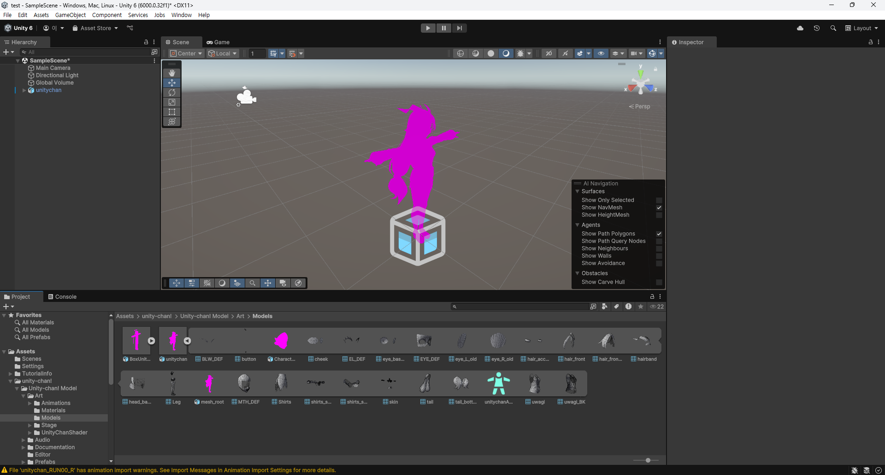
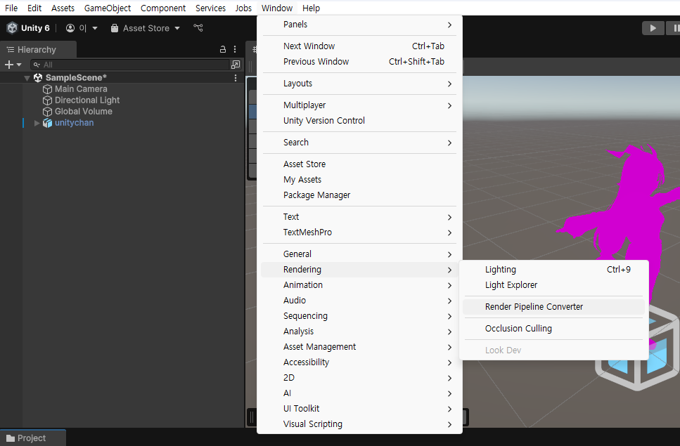
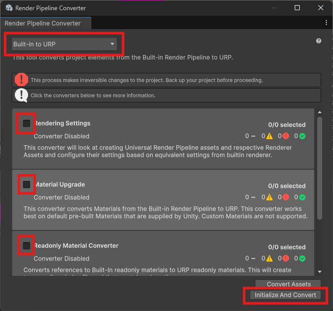
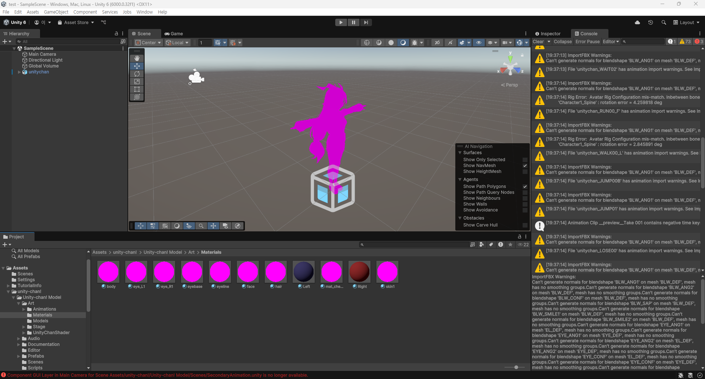
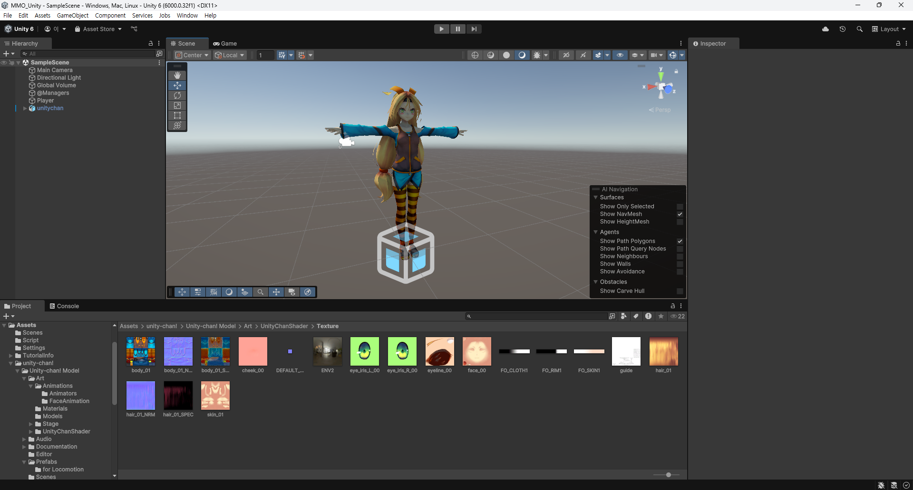
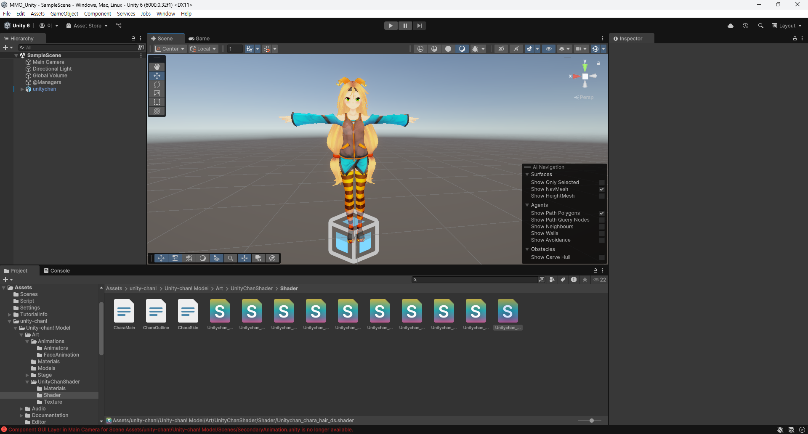

# URP 호환성 문제

## 상황
- Unity 6000.0.32f1 버전에서 Unity-chan 에셋을 import 했다.
- Unity-chan 에셋의 3D 모델을 가져오면 마젠타색으로 덮혀져 있다.



- 이러한 문제는 쉐이더가 호환되지 않아 발생하는 문제이다.

## 해결 과정 1
- Windows > Rending > Rendering Pipeline Converter를 실행한다.



- Built-in to URP로 설정하고 모든 항목을 선택한다.
- Initialize and Convert를 실행한다.



- 그러나 몇몇 Material만 수정되고 거의 대부분은 여전히 그대로이다.



## 해결 과정 2
- 문제가 발생한 Material의 Shader를 Universal Render Pipeline/Nature/SpeedTree7으로 변경해보았다.
- 홍조나 눈동자 같은 것들은 Universal Render Pipeline/Nature/SpeedTree8로 변경해보았다.



- SpeedTree는 실시간으로 나무나 식물을 현실감 있게 표현하기 위한 쉐이더이다.
- 추측
	- SpeedTree는 Unity-chan의 쉐이더 방식과 URP 모두 지원한다.
	- 즉, Unity-chan의 쉐이더 방식을 토대로 URP 방식으로 렌더링 하고 있는 것

## 해결 과정 3
- Unity-chan의 shader 파일을 직접 수정해 보았다.
- Unity의 shader 파일은 ShaderLab이라는 Unity 고유 언어로 작성된다.
- Unity의 ShaderLab은 HLSL이나 CG(C for Graphic)으로 번역되어 실행된다.

### 아주 얕은 ShaderLab의 구조
#### Properties
- Material 인스펙터 창에 나오는 요소들이다.
- 이 값들은 Material의 데이터로 직렬화된다.
- 보통 인스펙터 창에 나올 이름, 타입으로 표시된다.
```ShaderLab
name ("display", type)
```
#### Subshader
- 실제 그래픽 카드에서 실행될 것들을 작성하는 영역이다.
- Tags와 Pass 등으로 구성되어 있다.
##### Tags
- Subshader의 parameter를 지정한다.
- 렌더링 엔진이 어떻게 렌더링하고 언제 렌더링 할지를 지정한다.
##### Pass
- 실제 렌더링이 이루어지는 공간이다.
- 보통 몇몇 옵션과 함께, CG로 작성되어 있다.

## 해결 방법
- Subshader Tags에 `"LightMode"="ForwardBase"`를 제거하고, `"RednererPipeLine="UnversalPipeline"`을 추가한다.
- Subshader의 모든 Pass에 `Tags{ "LigthMode" = "UniversalForward" }`를 추가한다.



> 참고 자료
> - [Unity 문서](https://docs.unity3d.com/kr/2019.4/Manual/ShaderTut1.html)
> - [ShaderLag 자료](https://m.blog.naver.com/enter_maintanance/221418114288)